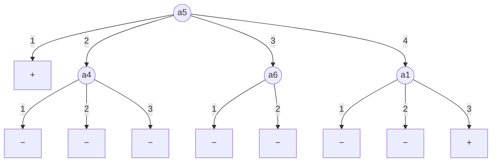

Labb 1 i [[DD2421 Maskininlärning kursinformation|DD2421]] går ut på att lära ett [[Beslutsträd|beslutsträd]] tre begrepp: MONK-datamängderna, och sedan studera vad som händer när trädet växer sig för stort. Se [[Ordning inför labb 1 i Maskininlärning]] för läsordningen.
## MONK-datamängderna
Samtliga tre problem är binär klassificering över samma sex diskreta attribut:
$$ a_1,a_2,a_4\in\{1,2,3\},\qquad a_3,a_6\in\{1,2\},\qquad a_5\in\{1,2,3,4\} $$
Det ger $3\cdot3\cdot2\cdot3\cdot4\cdot2=432$ möjliga kombinationer. Varje kombination är positiv eller negativ enligt ett **dolt begrepp** som inlärningsalgoritmen aldrig får se:
- MONK-1: $(a_1=a_2)\vee(a_5=1)$
- MONK-2: $a_i=1$ för exakt två $i\in\{1,\dots,6\}$
- MONK-3: $(a_5=3\wedge a_4=1)\vee(a_5\ne4\wedge a_2\ne3)$, dessutom med 5 % felmärkta träningsexempel. Labb-PDF:en skriver $a_5=1$ i tabell 1, men det är ett tryckfel: både `monks.names` och den bortkommenterade raden i `dectrees-py.tex` säger $a_5=3$.
Träningsmängderna innehåller 124, 169 respektive 122 exempel, medan testmängden alltid är alla 432 instanser.
## Assignment 0
Frågan är vilket av de tre problemen som är svårast för ett beslutsträd att lära sig.
### Svar: MONK-2 är svårast
Begreppet är en **symmetrisk räknefunktion**. Klassen beror på *hur många* attribut som är 1, inte på vilka. Därför bär inget enskilt attribut information om klassen: $(1,1,2,2,2,2)$ är positiv medan $(1,1,1,2,2,2)$ är negativ, trots att bara $a_3$ skiljer dem åt.
Det slår direkt mot informationsvinsten. Över alla 432 instanser är 32,9 % positiva, och delar man upp datan på vilket attribut som helst ligger varje gren kvar på mellan 26 % och 36 % positiva. Alltså är $\mathrm{Gain}(S,A)\approx0$ för samtliga sex attribut.
## Assignment 1
```python 
from dtree import entropy
from monkdata import monk1, monk2, monk3

print(entropy(monk1))
print(entropy(monk2))
print(entropy(monk3))
```
Prints:

| Dataset | Entropy            |
| ------- | ------------------ |
| Monk1   | 1.0                |
| Monk2   | 0.9571174282647708 |
| Monk3   | 0.9998061328047110 |
Since the target is binary, entropy depends on nothing except the class balance: $H = -p_+\log_2 p_+ - p_-\log_2 p_-$. So the numbers are really just a restatement of those counts:
## Assignment 2
What entropy measures
$$H(X) = -\sum_i p_i \log_2 p_i$$
Read $-\log_2 p_i$ as the surprise of outcome $i$: a rare outcome ($p$ small) is very surprising, a certain one ($p=1$) carries zero surprise. Entropy is then just the expected surprise (like an expected value). In bits, it's the average number of yes/no questions you need to pin down the outcome, given an optimal questioning strategy. 
### Uniform distributions
When all $n$ outcomes are equally likely, $p_i = 1/n$ for every $i$, and the sum collapses:
$$H = -\sum_{i=1}^{n} \tfrac{1}{n}\log_2\tfrac{1}{n} = \log_2 n$$
This is the maximum entropy achievable over $n$ outcomes. Intuitively: nothing distinguishes the outcomes, so there's no way to guess better than chance and no way to encode the result in fewer than $\log_2 n$ bits on average. Every observation delivers the full $\log_2 n$ bits of information because you genuinely knew nothing beforehand.
### Non-uniform distributions
As soon as probability mass concentrates on some outcomes, entropy drops. The high-probability outcomes contribute little surprise and occur often; the surprising outcomes are rare enough that they barely move the average. In the limit where one outcome has $p=1$, entropy is exactly 0- the result is already known, so observing it tells you nothing.

The bound is therefore $0 \le H \le \log_2 n$, with the lower end at total certainty and the upper end at total ignorance.

| Distribution             | $H$ |                |
| ------------------------ | --- | -------------- |
| Two-headed coin, $(0,1)$ | 0   | No uncertainty |
| Biased coin, $(0.9,\;0.1)$ | 0.469 | Mostly predictable |
| Fair coin, $(0.5,\;0.5)$ | 1   | Maximum for $n=2$ |
| Fair die, $(\tfrac16,\dots,\tfrac16)$ | 2.585 | Maximum for $n=6$, $\log_2 6$ |
| Loaded die, $(0.5,\;0.1,\dots,0.1)$ | 2.161 | Same support, less uncertainty |

The values are computed in `python/assignment_2.py`.

Two things to notice in that table:

The uniform case dominates at fixed $n$. Compare the fair die (2.585) against the loaded die with the same six faces (2.161) and the heavily loaded one (0.402). Same outcome space, strictly less uncertainty once the mass concentrates.

More outcomes doesn't automatically mean more entropy. The very loaded die has six possible faces but only 0.40 bits; less than a fair coin's 1.0 bit. It's the shape of the distribution that matters, not the size of the support. A large alphabet you can predict is easier than a small one you can't.

The shape of the binary case

For two classes, $H(p) = -p\log_2 p - (1-p)\log_2(1-p)$ traces a symmetric hump: 0 at both ends, peaking at 1.0 when $p = 0.5$. It's flat near the top (the maximum means $dH/dp = 0$ there, so deviations cost only quadratically) and steep near the edges. That's exactly the effect you saw in your own numbers: MONK-3 at $p_+ = 0.4918$ still scores 0.99981, while MONK-2 at $p_+ = 0.3787$ drops to 0.9571: a much larger shift in $p$ buying a still-modest drop in $H$.

In ID3, entropy is the impurity measure at a node. Information gain is the drop in entropy from splitting on an attribute:
$$\text{Gain}(S, A) = H(S) - \sum_{v}\frac{|S_v|}{|S|}H(S_v)$$
A good attribute is one that carves the data into subsets that are individually far from uniform, mostly-positive or mostly-negative, because a low-entropy subset is one where you can confidently predict a label. Splitting to minimise weighted entropy is the same thing as splitting to maximise how much the answer tells you.
## Assignment 3
```python
from dtree import entropy, averageGain
from monkdata import attributes, monk1, monk2, monk3

monks = (monk1, monk2, monk3)

for name, monk in zip(("MONK 1", "MONK 2", "MONK 3"), monks):
    print(f"======== {name} ========")
    for attribute in attributes:
        print(f"{attribute.name} = {averageGain(monk, attribute)}")
```
Det här skrev ut:
```
======== MONK 1 ========
A1 = 0.07527255560831925
A2 = 0.005838429962909286
A3 = 0.00470756661729721
A4 = 0.02631169650768228
A5 = 0.28703074971578435
A6 = 0.0007578557158638421
======== MONK 2 ========
A1 = 0.0037561773775118823
A2 = 0.0024584986660830532
A3 = 0.0010561477158920196
A4 = 0.015664247292643818
A5 = 0.01727717693791797
A6 = 0.006247622236881467
======== MONK 3 ========
A1 = 0.007120868396071844
A2 = 0.29373617350838865
A3 = 0.0008311140445336207
A4 = 0.002891817288654397
A5 = 0.25591172461972755
A6 = 0.007077026074097326
```
Rotnoden ska testa det attribut som har störst informationsvinst (fetstil):

| Datamängd | $a_1$ | $a_2$ | $a_3$ | $a_4$ | $a_5$ | $a_6$ |
| --------- | ----- | ----- | ----- | ----- | ----- | ----- |
| MONK-1 | 0.0753 | 0.0058 | 0.0047 | 0.0263 | **0.2870** | 0.0008 |
| MONK-2 | 0.0038 | 0.0025 | 0.0011 | 0.0157 | **0.0173** | 0.0062 |
| MONK-3 | 0.0071 | **0.2937** | 0.0008 | 0.0029 | 0.2559 | 0.0071 |

- **MONK-1: $a_5$**, med stor marginal, eftersom $a_5=1$ ensamt avgör klassen. Delen $a_1=a_2$ syns inte alls när attributen testas ett i taget: räknat över alla 432 instanser är vinsten för $a_1$ och $a_2$ exakt 0, eftersom $P(a_1=a_2\mid a_1=v)=\tfrac13$ för varje $v$. De 0.075 som $a_1$ får här beror alltså bara på vilka 124 exempel som råkade hamna i träningsmängden.
- **MONK-2: $a_5$**, men bara med 0.0016 före $a_4$. Alla sex vinster är i praktiken noll, precis som [[#Assignment 0]] förutsade, så valet av rot är närmast slumpmässigt.
- **MONK-3: $a_2$.** Både $a_2$ och $a_5$ ingår i begreppet och har höga vinster. Räknat över alla 432 instanser vinner egentligen $a_5$ (0.348 mot 0.319), så även här styr stickprovet (och bruset) vilket attribut som hamnar i roten.
## Assignment 4
Eftersom $\mathrm{Entropy}(S)$ är densamma för alla attribut maximeras [[Informationsvinst|informationsvinsten]] genom att minimera den viktade entropin $\sum_k \frac{|S_k|}{|S|}\mathrm{Entropy}(S_k)$. När vinsten är maximal är delmängderna $S_k$ alltså så **rena** som möjligt, med entropi nära 0. I bästa fall är varje $S_k$ helt ren, och då blir vinsten hela $\mathrm{Entropy}(S)$.
MONK-1 visar det tydligt (`python/assignment_4.py`). Bästa attributet $a_5$ ger en helt ren delmängd, och övriga grenar ligger kvar nära 1 bit:

| $a_5$ | $\lvert S_k\rvert$ | positiva | $\mathrm{Entropy}(S_k)$ |
| ----- | ----- | ----- | ----- |
| 1 | 29 | 29 | 0.000 |
| 2 | 31 | 11 | 0.938 |
| 3 | 30 | 11 | 0.948 |
| 4 | 34 | 11 | 0.908 |

Den viktade entropin blir $0.713$ och vinsten $1-0.713=0.287$. Det sämsta attributet $a_6$ ger två delmängder med entropi 0.999 och därmed vinsten 0.0008. Uppdelningen säger alltså ingenting om klassen.
### Varför informationsvinst är en bra heuristik
[[Entropi i informationsteori|Entropin]] i en nod är det förväntade antalet bitar som fortfarande saknas för att bestämma klassen. Informationsvinsten är därmed hur mycket osäkerheten om klassen i genomsnitt minskar när man får veta attributets värde, alltså den ömsesidiga informationen $I(Y;A)$. Att girigt välja attributet med störst vinst betyder att ställa den fråga som säger mest om svaret.
Låg entropi i delmängderna betyder att de ligger nära att bli rena löv. Trädet når därför löv snabbare och blir kortare, vilket ger ID3 en preferens för små träd i [[Occams rakkniv|Occams rakknivs]] anda. Begränsningen är att valet görs en nivå i taget. Ett attribut som bara hjälper i kombination med ett annat får ingen vinst, som $a_1$ och $a_2$ i MONK-1 eller alla attribut i MONK-2.
## Bygga beslutsträd
Uppdelningen på andra nivån görs i `python/building_trees.py`. Roten är $a_5$, och för varje gren beräknas vinsterna för de återstående attributen:

| Gren | $a_1$ | $a_2$ | $a_3$ | $a_4$ | $a_6$ | Val |
| ---- | ----- | ----- | ----- | ----- | ----- | --- |
| $a_5=1$ (29 st.) | – | – | – | – | – | ren, löv $+$ |
| $a_5=2$ (31 st.) | 0.0402 | 0.0151 | 0.0373 | **0.0489** | 0.0258 | $a_4$ |
| $a_5=3$ (30 st.) | 0.0331 | 0.0022 | 0.0180 | 0.0191 | **0.0451** | $a_6$ |
| $a_5=4$ (34 st.) | **0.2063** | 0.0339 | 0.0259 | 0.0759 | 0.0033 | $a_1$ |

Löven på andra nivån får majoritetsklassen enligt `mostCommon`:

`buildTree(monk1, attributes, 2)` ger samma träd, `A5(+A4(---)A6(--)A1(--+))`, så handberäkningen stämmer. Trädet fångar $a_5=1$ direkt men nästan inget av $a_1=a_2$: i grenarna $a_5=2$ och $a_5=3$ är alla vinster under 0.05 och de valda attributen hör inte till begreppet.
## Assignment 5
Koden finns i `python/assignment_5.py`. Felet för ett fullt träd är $1-$`check`:

| | $E_\mathrm{train}$ | $E_\mathrm{test}$ |
| --- | --- | --- |
| MONK-1 | 0 | 0.1713 |
| MONK-2 | 0 | 0.3079 |
| MONK-3 | 0 | 0.0556 |

MONK-2 är svårast och MONK-3 lättast, precis som [[#Assignment 0]] förutsade.
- **Träningsfelet är 0** eftersom ID3 delar tills varje löv är rent. Det säger ingenting om hur bra trädet är, se [[Överanpassning]].
- **MONK-2** är knappt bättre än att alltid gissa negativt ($142/432=0.329$). Trädet har memorerat träningsexemplen utan att lära sig begreppet.
- **MONK-1** kräver djupa grenar för att uttrycka $a_1=a_2$, och med 124 exempel hamnar få exempel i varje löv.
- **MONK-3** får de flesta felen från små delträd som har memorerat de felmärkta exemplen.
## Assignment 6
Ett fullvuxet träd har låg bias men hög varians ([[Bias-varians-avvägningen]]). De djupa grenarna bestäms av enstaka exempel, så några ändrade träningsexempel ger ett helt annat träd. [[Beskärning av beslutsträd|Beskärning]] ersätter delträd med löv och minskar [[Modellkomplexitet|modellkomplexiteten]]. Variansen minskar eftersom enstaka exempel, till exempel felmärkta, inte längre får egna grenar. Biasen ökar eftersom verklig struktur i ett borttaget delträd går förlorad. Man beskär så länge valideringsfelet inte ökar, och vid lika fel väljs det enklare trädet enligt [[Occams rakkniv]].
Med brus, som i MONK-3, domineras felet av varians och beskärning lönar sig. Utan brus, som i MONK-1, bär även djupa grenar verklig information, och då riskerar beskärning att bara lägga till bias.
## Assignment 7
Koden finns i `python/assignment_7.py`. I varje steg väljs den kandidat från `allPruned` som har högst valideringsnoggrannhet, och man slutar när alla kandidater är sämre än det nuvarande trädet:
```python
def prune(tree, validation):
    accuracy = check(tree, validation)
    while candidates := allPruned(tree):
        bestAccuracy, best = max(((check(t, validation), t) for t in candidates), key=lambda s: s[0])
        # ties are accepted: at equal validation accuracy the smaller tree wins
        if bestAccuracy < accuracy:
            break
        tree, accuracy = best, bestAccuracy
    return tree

for fraction in FRACTIONS:
    pruned, unpruned = [], []
    for _ in range(RUNS):
        t, v = partition(train, fraction)
        tree = buildTree(t, attributes)
        unpruned.append(1 - check(tree, test))
        pruned.append(1 - check(prune(tree, v), test))
```
Varje punkt är medelvärdet över 100 körningar (`random.seed(2421)`), och spridningen står som standardavvikelse i tabellen. De horisontella linjerna är testfelen från Assignment 5:
![[labb1-beskarning-testfel.png|600]]

| fraction | MONK-1 beskuret | MONK-1 obeskuret | MONK-3 beskuret | MONK-3 obeskuret |
| -------- | --------------- | ---------------- | --------------- | ---------------- |
| 0.3 | 0.230 ± 0.035 | 0.246 | 0.080 ± 0.065 | 0.107 |
| 0.4 | 0.216 ± 0.041 | 0.215 | 0.068 ± 0.053 | 0.099 |
| 0.5 | 0.202 ± 0.041 | 0.189 | 0.038 ± 0.033 | 0.081 |
| 0.6 | **0.195 ± 0.043** | 0.163 | 0.036 ± 0.030 | 0.082 |
| 0.7 | 0.198 ± 0.040 | 0.149 | **0.033 ± 0.031** | 0.070 |
| 0.8 | 0.226 ± 0.034 | 0.143 | 0.049 ± 0.039 | 0.066 |

"Obeskuret" är samma träd före beskärning, så skillnaden mellan kolumnerna är vad beskärningen bidrar med.
### MONK-3: beskärning hjälper
Beskärning sänker testfelet vid alla värden på `fraction`. Bäst är 0.7 med $3.3\,\%\pm3.1\,\%$, vilket är lägre än det obeskurna trädet på hela träningsmängden (5.6 %). Det som beskärs bort är delträden som memorerade de felmärkta exemplen. Skillnaderna mellan 0.5 och 0.7 ligger inom medelfelet $\sigma/\sqrt{100}\approx0.3$ procentenheter, så de är i praktiken lika bra.
### MONK-1: beskärning skadar
Bäst är 0.6 med $19.5\,\%\pm4.3\,\%$, men det är ändå sämre än det obeskurna trädet på hela träningsmängden (17.1 %). MONK-1 saknar brus, så de djupa grenarna uttrycker den verkliga regeln $a_1=a_2$. Varje sådan gren täcks av få valideringsexempel, och eftersom oavgjort räcker för att beskära tas den bort. Beskärningen lägger alltså bara till bias, och effekten förvärras när valideringsmängden krymper vid stor `fraction`.
### Slutsats
`fraction` $\approx0.6$–$0.7$ balanserar data för att bygga trädet mot data för att beskära det. Beskärning lönar sig bara när felet domineras av varians, som i MONK-3. Med så lite data vore [[Korsvalidering|korsvalidering]] ett bättre sätt att utnyttja alla exempel.
